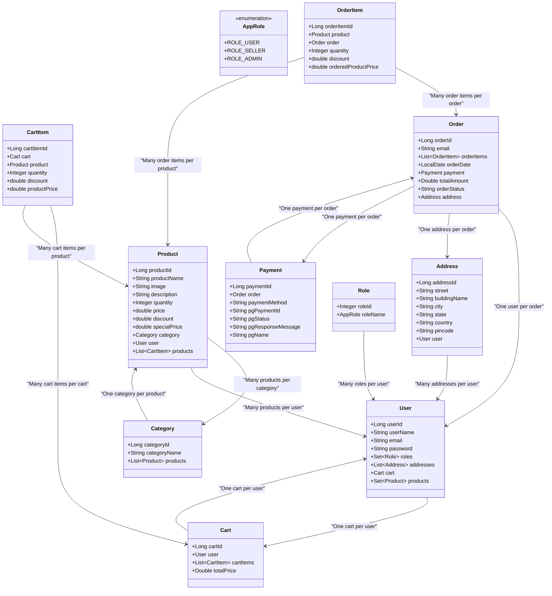

```mermaid
classDiagram
    class Address {
        +Long addressId
        +String street
        +String buildingName
        +String city
        +String state
        +String country
        +String pincode
        +User user
    }

    class AppRole {
        <<enumeration>>
        +ROLE_USER
        +ROLE_SELLER
        +ROLE_ADMIN
    }

    class Cart {
        +Long cartId
        +User user
        +List~CartItem~ cartItems
        +Double totalPrice
    }

    class CartItem {
        +Long cartItemId
        +Cart cart
        +Product product
        +Integer quantity
        +double discount
        +double productPrice
    }

    class Category {
        +Long categoryId
        +String categoryName
        +List~Product~ products
    }

    class Order {
        +Long orderId
        +String email
        +List~OrderItem~ orderItems
        +LocalDate orderDate
        +Payment payment
        +Double totalAmount
        +String orderStatus
        +Address address
    }

    class OrderItem {
        +Long orderItemId
        +Product product
        +Order order
        +Integer quantity
        +double discount
        +double orderedProductPrice
    }

    class Payment {
        +Long paymentId
        +Order order
        +String paymentMethod
        +String pgPaymentId
        +String pgStatus
        +String pgResponseMessage
        +String pgName
    }

    class Product {
        +Long productId
        +String productName
        +String image
        +String description
        +Integer quantity
        +double price
        +double discount
        +double specialPrice
        +Category category
        +User user
        +List~CartItem~ products
    }

    class Role {
        +Integer roleId
        +AppRole roleName
    }

    class User {
        +Long userId
        +String userName
        +String email
        +String password
        +Set~Role~ roles
        +List~Address~ addresses
        +Cart cart
        +Set~Product~ products
    }

    Address --> User : "Many addresses per user"
    Cart --> User : "One cart per user"
    CartItem --> Cart : "Many cart items per cart"
    CartItem --> Product : "Many cart items per product"
    Category --> Product : "One category per product"
    Order --> User : "One user per order"
    Order --> Address : "One address per order"
    Order --> Payment : "One payment per order"
    OrderItem --> Order : "Many order items per order"
    OrderItem --> Product : "Many order items per product"
    Payment --> Order : "One payment per order"
    Product --> Category : "Many products per category"
    Product --> User : "Many products per user"
    Role --> User : "Many roles per user"
    User --> Cart : "One cart per user"

```
